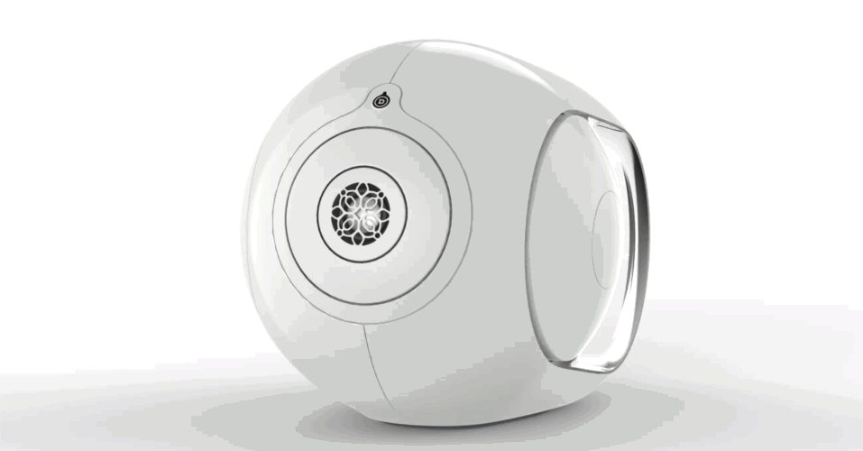
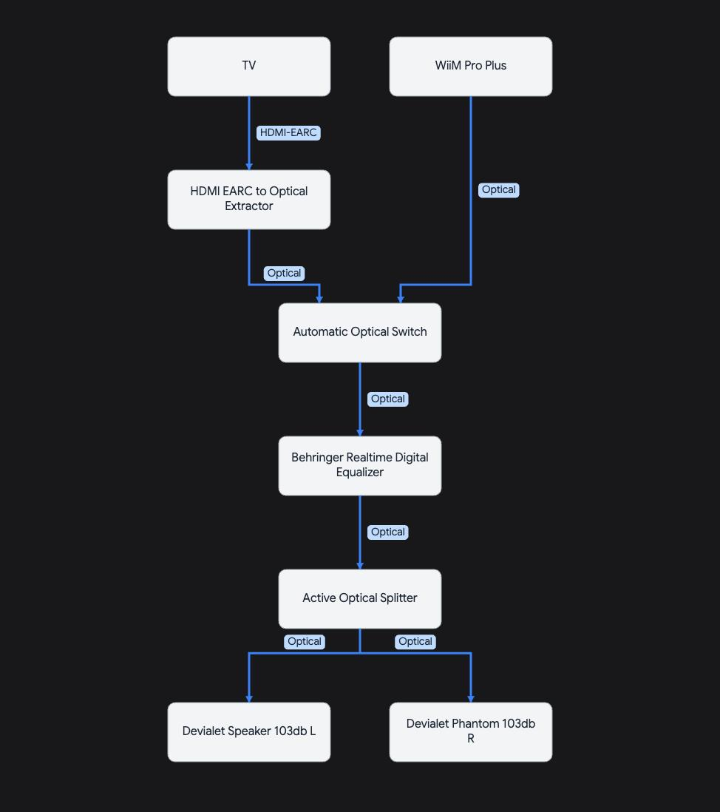

# Devialet IR Volume Controller



Add IR remote volume control to Devialet Phantom speakers in **[Optical Direct mode](https://help.devialet.com/hc/en-us/articles/360019120140-Optical-Direct-on-Phantom-Custom-installations)** for ~$45 in hardware.

## The Problem

When you enable [Optical Direct mode](https://help.devialet.com/hc/en-us/articles/360019120140-Optical-Direct-on-Phantom-Custom-installations) on Devialet Phantom 1 speakers (not available on Reactor, Phantom 2, Ultimate, etc.), you bypass the internal DAC to use optical input. Great for custom audio chains, but you lose volume control:

- [Devialet Remote](https://help.devialet.com/hc/en-us/articles/360000451145-The-Devialet-Remote-for-Phantom-I-Phantom-II-Devialet-Mania-or-Devialet-Dione) **stops working** (controls the bypassed DAC)
- TV remote **can't control speakers** (optical is one-way digital signal)
- You're stuck with the **clunky web interface**

## The Solution

This project restores IR remote volume control using an [M5StickC Plus2](https://www.amazon.com/dp/B0F3XQ22XS) ($35), an [IR receiver](https://www.amazon.com/dp/B087ZRD3LH) ($5), and [jumper wires](https://www.amazon.com/dp/B01EV70C78) ($5). 

The M5StickC intercepts IR commands from any TV remote (Samsung remotes by default, but you can modify `include/Config.h` as needed) and sends them to your speakers via WiFi using the Devialet API. Your speakers must be connected via Ethernet for API access since the Devialet Phantom 1 speakers lose WiFi connectivity in Optical Direct mode. 

## What It Does

- **IR control**: Use any TV remote to adjust Devialet speaker volume
- **Physical buttons**: M5StickC has volume up/down buttons as backup
- **Auto-discovery**: Finds all Devialet speakers on your network via mDNS
- **Optional multi-speaker sync**: Volume control can sync multiple speakers to the same level
- **Fast UI**: Display updates instantly (<50ms), confirmed after API call
- **Mute toggle**: Press once to mute, again to restore previous volume
- **Auto-sleep**: Screen turns off after 5 seconds to save power
- **Auto-recovery**: Handles network issues and speaker IP changes gracefully

## Display

```
L: 60%
R: 65%
```

Volume displayed per speaker with color coding:
- Grey: 0-34%
- Orange: 35-69%  
- Red: 70-100%

## Hardware Requirements

**For IR Volume Control (this project):**
- [M5StickC Plus2](https://www.amazon.com/dp/B0F3XQ22XS) - $35
- [IR Receiver Module (TL1838/VS1838B)](https://www.amazon.com/dp/B087ZRD3LH) - $5
- [Dupont Jumper Wires](https://www.amazon.com/dp/B01EV70C78) - $5
- Any Samsung TV remote (or program custom codes)

**Wiring**: IR OUT→GPIO33, VCC→3.3V, GND→GND

**For Devialet Speakers:**
- Speakers must be in [Optical Direct mode](https://help.devialet.com/hc/en-us/articles/360019120140-Optical-Direct-on-Phantom-Custom-installations)
- Speakers must be connected via **Ethernet** (WiFi API access not reliable)

## Setup

1. Install [PlatformIO](https://platformio.org/install) or [VS Code](https://code.visualstudio.com/) + [PlatformIO IDE extension](https://marketplace.visualstudio.com/items?itemName=platformio.platformio-ide)
2. Clone repo and open in VS Code or PlatformIO
3. Copy `include/Secrets.h.example` → `include/Secrets.h` and add WiFi credentials
4. *(Optional)* Customize settings in `include/Config.h`
5. Connect device via USB
6. Build and upload to device

## Configuration

All configuration options are centralized in `include/Config.h`:

### Hardware Settings
- **IR_PIN** (33): GPIO pin for IR receiver

### IR Remote Settings
- **IR Codes**: Pre-configured Samsung TV codes + custom codes
- **IR_REPEAT_INTERVAL_MS** (125): Time between repeated volume commands (125ms=fast, 250ms=moderate, 500ms=slow)
- **IR_MUTE_REPEAT_INTERVAL_MS** (500): Time between mute button presses (allows toggle detection)
- **IR_MIN_BITS** (8): Minimum valid IR signal bits (filters noise)

### Display Settings
- **DISPLAY_SLEEP_MS** (5000): Auto-sleep timeout in milliseconds
- **VOLUME_COLOR_LOW_THRESHOLD** (35): Volume % for grey/orange transition
- **VOLUME_COLOR_HIGH_THRESHOLD** (70): Volume % for orange/red transition

### Volume Control
- **VOLUME_INCREMENT** (1): Volume change per button press (%)
- **VOLUME_MIN/MAX** (0/100): Volume limits
- **SYNC_SPEAKER_VOLUMES** (true): Sync all speakers to same volume on commands

### Network Settings
- **WIFI_RECONNECT_INTERVAL_MS** (5000): WiFi retry interval
- **HTTP_TIMEOUT_MS** (300): API request timeout

### Adding Custom Remote Codes
1. Set `DEBUG_LOGGING 1` in `Logger.h`
2. Monitor serial output while pressing remote buttons
3. Note the hex codes displayed
4. Add codes to `IRCodes::Custom` namespace in `Config.h`

## Reliability

### Auto-Recovery
The device automatically handles network issues and IP address changes:

- **Lazy Recovery**: Only triggers rediscovery when needed (after a failure)
- **User-Triggered**: Recovery happens on next button press, not in background
- **Smart Detection**: Activates when any speaker fails to respond
- **Zero Overhead**: No performance impact during normal operation

Perfect for long-running deployments where router reboots or DHCP lease renewals might change speaker IP addresses.

## How It Works

**Hardware**: IR receiver catches remote button presses, M5StickC decodes them and sends HTTP requests to the Devialet API over WiFi.

**Software highlights**:
- Non-blocking HTTP (300ms timeout per request)
- Optimistic UI updates (instant feedback, verified after)
- Throttled repeats (prevents command spam)
- Lazy auto-recovery (rediscovers speakers only when needed)
- Header-only modular design (no .cpp files)

All configuration lives in `include/Config.h` for easy tweaking.

---

## Advanced: Low-Latency Audio Chain Setup

If you need **low-latency audio** for gaming, live music, or movies where lip-sync matters, here's a complete setup using Optical Direct mode with EQ and support for multiple inputs:

### Signal Flow

**Audio path:** TV/Streamer → Auto Switch → Hardware EQ → Optical Splitter → L/R Speakers  
**Control path:** IR Remote → M5StickC → WiFi/Ethernet → Devialet API

All-optical audio = low latency and no DACs in the chain besides Devialet's. IR volume control operates independently over your network.



### Why This Setup?

Most all-in-one solutions like the [WiiM Ultra](https://www.amazon.com/dp/B0D41YCLW8) ($329) add **50ms+ latency** due to:
- Slow DSP processing for EQ
- ARC-only input (i.e. not EARC), which means no low-latency passthrough

This setup uses **hardware DSP** and **all-optical signal path** for instant processing with lossless audio.

### Components

**Audio Sources:**
- TV with [HDMI eARC Extractor](https://www.amazon.com/dp/B0FGKVF9ZS) - Extracts optical from eARC (digital & low latency)
- [WiiM Pro Plus](https://www.amazon.com/dp/B0CC2HWC7N) - Streaming (AirPlay 2, Chromecast, Spotify Connect)

**Signal Processing:**
- [Automatic Optical Switch](https://www.amazon.com/dp/B0D45GY575) - Auto-selects active source
- [Behringer DEQ2496](https://www.amazon.com/dp/B000CCN152) - Digital equalizer with hardware DSP (zero-latency room EQ)
- [Active Optical Splitter](https://www.amazon.com/dp/B0CFY365KH) - Splits to stereo pair

**Speakers:**
- Devialet Phantom 103dB (L + R) in Optical Direct mode via Ethernet. Which speaker is L or R is configured via [Optical Direct mode](https://help.devialet.com/hc/en-us/articles/360019120140-Optical-Direct-on-Phantom-Custom-installations) on each speaker's website.

**Volume Control:**
- [M5StickC Plus2](https://www.amazon.com/dp/B0F3XQ22XS) - $35
- [IR Receiver Module](https://www.amazon.com/dp/B087ZRD3LH) - $5
- [Dupont Jumper Wires](https://www.amazon.com/dp/B01EV70C78) - $5
- Any Samsung TV remote

### When to use this setup?

**This setup (complex):**
- Gaming or live music (latency matters)
- Sensitive to lip-sync on movies & TV
- Need hardware room EQ with low-latency

**WiiM Ultra (simple):**
- Casual music listening
- Don't care about 50ms+ delay
- Want one box instead of five
- Software EQ is acceptable

## License

MIT
